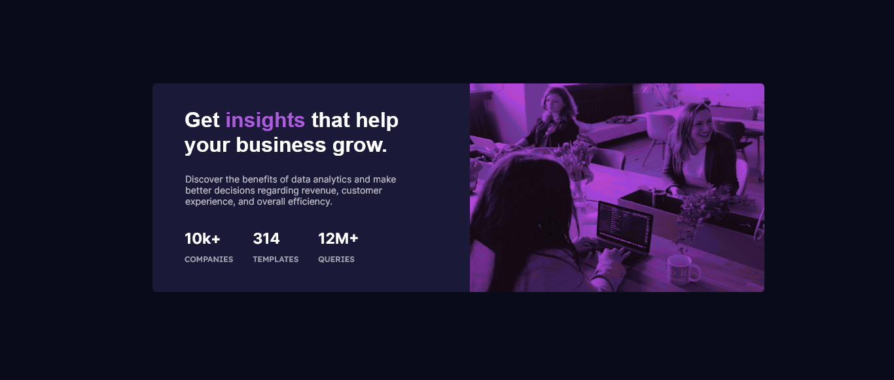

# Frontend Mentor - Stats preview card component solution

This is a solution to the [Stats preview card component challenge on Frontend Mentor](https://www.frontendmentor.io/challenges/stats-preview-card-component-8JqbgoU62). Frontend Mentor challenges help you improve your coding skills by building realistic projects. 

## Table of contents

- [Overview](#overview)
  - [The challenge](#the-challenge)
  - [Screenshot](#screenshot)
  - [Links](#links)
- [My process](#my-process)
  - [Built with](#built-with)
  - [What I learned](#what-i-learned)
  - [Useful resources](#useful-resources)
- [Author](#author)

## Overview

### The challenge

Users should be able to:

- View the optimal layout depending on their device's screen size

### Screenshot



### Links

- Solution URL: [My solution URL here](https://your-solution-url.com)
- Live Site URL: [My live site URL here](https://stats-preview-main.netlify.app/)

## My process

### Built with

- Semantic HTML5 markup
- CSS custom properties
- Flexbox

### What I learned

It's been a bit challenging to add that purple filter to the image.😄
So I had to use some Googling...

```css
      filter:invert(0%) brightness(39%) sepia(27%) hue-rotate(232deg) saturate(1471%) contrast(92%);
```


### Useful resources

- [CSS Filter](https://www.example.com) - This helped me for knowing which color was used as the overlay on the image **reason**. I really liked the way it changed the purple color (#aa5cdb) to (filter:invert(0%) brightness(39%) sepia(27%) hue-rotate(232deg) saturate(1471%) contrast(92%);).

## Author

- Frontend Mentor - [@Mu-Solomon](https://www.frontendmentor.io/profile/Mu-Solomon)
- Email - [Mu-Solomoni](mailto:musolomoni@gmail.com)
